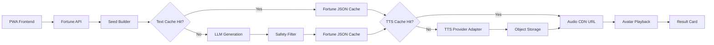

# 오늘신당 MVP 실행 계획

작성일: 2026-05-22 · v3 동기화: 2026-05-29
기준 문서: `docs/planning/today-shindang-service-plan-v3.md` (이전 기준: v2)

> **v3 동기화(2026-05-29)**: 본 실행계획을 분석 리포트(`docs/reports/문서-분석-리포트-2026-05-29.md`)에 따라 v3 결정값으로 정정했다. 핵심 변경 — ① 베타 캐릭터 **홍연 1종 단독** 고정, ② 운세 출력 스키마 **`fortune-schema.v1.1.json`**(narration 제거·`scores_line` 추가, narration은 서버 조립), ③ 개인정보 **동의 기반 서버 저장 단일화 + HMAC 캐시키 분리**, ④ **3초 SLA 재정의**(완성 음성이 아니라 '탭 후 첫 반응'까지), ⑤ **autoplay 금지 전제**(사용자 탭으로 AudioContext 오픈), ⑥ 실패/지연 분석 이벤트 보강.

## 1. 목표

`오늘신당`의 1차 목표는 "매일 1분짜리 캐릭터 운세 공연"을 모바일 웹/PWA로 검증하는 것이다. MVP는 운세 정보량보다 캐릭터 선택, 음성 청취, 결과 카드 저장/공유, 다음 날 재방문 의향을 검증하는 데 집중한다.

성공 기준은 다음 4가지를 먼저 본다.

- 운세 생성 완료율 70% 이상
- 첫 반응(사전합성 인사 음성 + 요약/로딩 UI)까지 3초 이내 — v3 §11.1 재정의(개인화 텍스트·본문 음성은 LLM·TTS 완료에 종속되는 별도 지표)
- TTS 80% 이상 청취 완료율 60% 이상
- 결과 카드 저장/공유율 10% 이상

## 2. MVP 기본 결정

| 항목 | 결정안 |
| --- | --- |
| 플랫폼 | 모바일 우선 PWA |
| 프론트엔드 | Next.js 또는 Vite React + TypeScript |
| 캐릭터 | 베타는 홍연 1종 단독 고정. 소월은 v1.1에서 2종 선택 A/B로 검증, 강림은 프리미엄 후보 (v3 §7) |
| 운세 길이 | 무료 45-60초 TTS 기준 |
| 입력 | 닉네임, 생년월일, 출생시간 선택, 관심 주제 |
| 계정 | 첫 운세는 비회원 가능 |
| 개인정보 저장 | 동의 기반 서버 저장 단일화. 비회원은 로컬 우선, 캐시 키는 HMAC 해시만(원본 생년월일/출생시간 미포함) (v3 §12) |
| 공유 | 정적 부적 카드부터 시작 |
| 립싱크 | 음량 기반 입 모양 동기화까지만 |
| 오디오 재생 | 텍스트 먼저 노출 + 사전합성 인사 우선 재생. autoplay 금지(사용자 탭으로 AudioContext 오픈) (v3 §11.1–11.2) |
| 제외 | 실시간 상담, 3D VRM, 음소 기반 립싱크, 실제 상담사 연결 |

## 3. 0단계 의사결정

개발 착수 전에 아래 항목을 확정한다.

| 결정 항목 | 권장안 | 이유 |
| --- | --- | --- |
| 무료 캐릭터 수 | 1종 | 캐릭터 제작, 음성 QA, 모션 QA 비용을 낮춘다. |
| 무료 TTS 길이 | 45-60초 | 몰입감과 원가 사이의 균형점이다. |
| 출생정보 저장 | 동의 기반 서버 저장 | 캐시 키는 HMAC만 사용하고, 비회원은 로컬 우선으로 개인정보 부담을 낮춘다. |
| 첫 공유 포맷 | 정적 이미지 | 구현 난이도와 렌더링 비용이 낮다. |
| 첫 유료 상품 | 심화 운세 또는 캐릭터 패스 A/B 후보 | 팬덤 지표 전에는 단일 확정하지 않는다. |
| 보이스 | 기본 TTS 음색 + 캐릭터 말투 | 커스텀 보이스 계약은 베타 지표 이후 판단한다. |

## 4. 핵심 사용자 흐름

1. 사용자가 오늘의 무당을 선택한다(베타는 홍연 1종 고정).
2. 닉네임, 생년월일, 출생시간을 입력한다.
3. 관심 주제를 고른다.
4. 캐릭터 등장 애니메이션이 재생된다.
5. 서버가 seed 기반 운세 JSON(`fortune-schema.v1.1`)을 생성하거나 캐시에서 반환한다.
6. 운세 텍스트(요약·분야별 점수·행운 색상·행운 아이템·피해야 할 행동)를 완성 음성 대기 없이 먼저 화면에 노출한다.
7. 사용자가 '듣기'를 탭하면 사전합성 인사 음성을 즉시 재생하고(AudioContext 오픈), 캐릭터 speaking 상태와 함께 개인화 본문 음성을 이어 재생한다.
8. 사용자가 부적 카드를 저장하거나 공유한다.
9. streak와 내일 알림 유도 문구를 보여준다.

## 5. MVP 기능 백로그

### Frontend

- 모바일 온보딩 화면
- 무당 선택 화면
- 생년월일/출생시간 입력 UI
- 관심 주제 선택 UI
- 캐릭터 stage 화면
- 오디오 재생 상태 UI
- Web Audio API 기반 음량 분석
- idle, greeting, speaking, blessing 상태 전환
- 결과 카드 화면
- 공유 이미지 생성 화면
- PWA manifest와 기본 설치 대응

### Backend

- 운세 생성 API
- seed builder
- 운세 JSON validation
- 안전 필터
- TTS provider adapter
- 텍스트 캐시
- TTS 파일 캐시
- 오브젝트 스토리지 업로드
- 분석 이벤트 수집 endpoint
- rate limit과 하루 1회 무료 사용 제한

### AI/TTS

- 홍연 system prompt (`docs/prompts/fortune-prompt-hongyeon.v1.1.md`, scores_line 중간안)
- 운세 JSON schema (`fortune-schema.v1.1.json`: narration 제거·scores_line 추가)
- narration 서버 조립기 (`src/shindang/domain/narration.py`): greeting→summary→scores_line→advice→lucky→avoid→blessing→ending
- 금지 표현 필터 (safety prompt 후처리 검증)
- 45-60초 음성 길이 기준의 script compressor
- TTS provider 추상화
- 사전 합성 문장 세트: 인사, 전환, 축원, 엔딩

### Analytics

- `fortune_start`
- `fortune_complete`
- `tts_play_start`
- `tts_play_complete`
- `character_select`
- `share_card_create`
- `share_click`
- `push_permission_prompt`
- `push_permission_grant`
- `premium_view`
- `purchase_complete`
- `fortune_fail` (LLM/필터 오류)
- `cache_hit` / `cache_miss` (텍스트·TTS 캐시, 계층 태그)
- `tts_generate_start` / `tts_generate_complete` (본문 합성 지연 측정)
- `tts_play_error` (autoplay 차단·세션 중단)
- `share_fail`

## 6. 추천 아키텍처



권장 구성:

| 영역 | 1차 선택 |
| --- | --- |
| Frontend | Next.js 또는 Vite React + TypeScript |
| Styling | Tailwind CSS 또는 CSS Modules |
| Animation | Rive 우선 검토, Live2D는 리소스가 준비될 때 검토 |
| Backend | Next.js Route Handler 또는 Fastify |
| DB | PostgreSQL + Prisma |
| Cache | Redis |
| Queue | BullMQ 또는 managed queue |
| Storage | S3/R2 호환 object storage |
| Analytics | PostHog 우선 검토 |

## 7. API 초안

### `POST /api/fortune/today`

요청:

```json
{
  "nickname": "아리",
  "birthDate": "1998-03-14",
  "birthTime": "morning",
  "topic": "love",
  "characterId": "hongyeon",
  "locale": "ko-KR"
}
```

응답:

```json
{
  "fortuneId": "fortune_20260522_xxx",
  "characterId": "hongyeon",
  "date": "2026-05-22",
  "script": "오늘은 마음의 속도를 조금 늦추면...",
  "audioUrl": "https://cdn.example.com/tts/xxx.mp3",
  "durationSec": 54,
  "summary": ["오늘은 관계의 온도가 올라가는 날이에요."],
  "scores": {
    "love": 82,
    "money": 61,
    "work": 70,
    "relationship": 78,
    "condition": 66
  },
  "luckyColor": "coral red",
  "luckyItem": "작은 거울",
  "avoidAction": "답장을 너무 오래 미루기",
  "blessing": "홍연이 네 하루의 불씨를 밝혀줄게."
}
```

> 주의(v1.1): 위 응답은 클라이언트 표시용 평면 구조 예시다. 내부 LLM 출력 계약은 `fortune-schema.v1.1.json`을 따른다 — `summary`는 2문장, `lucky`는 `{ color, item }` 중첩, `scores_line`(점수 설명 1문장) 포함, `narration` 배열은 LLM이 출력하지 않고 서버가 조립한다. `script`/`audioUrl`은 서버가 narration을 조립·합성한 결과다.

### `POST /api/share-card`

요청:

```json
{
  "fortuneId": "fortune_20260522_xxx",
  "theme": "default"
}
```

응답:

```json
{
  "imageUrl": "https://cdn.example.com/share/xxx.png"
}
```

## 8. 운세 JSON 스키마

운세 출력 스키마의 **정본은 `contracts/fortune/fortune-schema.v1.1.json`**이다(JSON Schema Draft 2020-12). v1.1은 `narration` 배열을 LLM 출력에서 제거하고 `scores_line` 한 문장을 추가했으며, TTS narration은 서버(`src/shindang/domain/narration.py`)가 조립한다.

LLM 출력 필드(요약):

- `schema_version` = `fortune.v1.1`
- `meta`: `date`, `character_id`(베타 `hongyeon`), `topic`, `tone`(`bright`), `locale`(`ko-KR`), `seed_hash`(HMAC), `content_version`=`prompt.v1.1`
- `scores`: `love`/`money`/`work`/`relationship`/`condition` (0–100 정수)
- `scores_line`: 점수 흐름을 홍연 말투로 설명하는 1문장(12–120자)
- `summary`: 정확히 2문장
- `advice`: 1개(오늘 실천 가능한 작은 행동)
- `lucky`: `{ color, item }` (고정 풀에서 선택)
- `avoid`: 피해야 할 행동
- `blessing`: 캐릭터 축원(presynth 풀)

> 구 인라인 스키마(`luckyColor`/`luckyItem`/`avoidAction`/`script` 평면 구조)는 v1.1로 대체되어 제거했다. 클라이언트 응답 평면화가 필요하면 §7 API 계층에서 매핑한다.

## 9. 프롬프트/안전 기준

운세 문장은 다음 기준을 통과해야 한다.

- 불안 조장 금지
- 의료, 법률, 투자, 진학, 취업 결과 단정 금지
- 특정 구매나 결제를 액운 회피 수단으로 표현 금지
- 사용자가 오늘 바로 실천할 수 있는 작은 행동 제안
- 캐릭터별 말투 유지
- 45-60초 TTS에 맞는 길이 유지
- 한국 무속 문화를 공포나 조롱 소재로 소비하지 않기

홍연 말투 예시:

```text
밝고 리듬감 있게 말한다. 단정적인 예언보다 "오늘은 이런 흐름을 타기 좋아"처럼 하루의 기운을 정리한다. 사용자를 몰아붙이지 않고, 작은 실천을 권한다.
```

## 10. 캐싱 및 원가 통제

캐시 키는 개인정보 원문을 포함하지 않는다.

```text
fortune:v1:{date}:{birth_profile_hash}:{topic}:{character_id}:{tone}:{locale}
tts:v1:{provider}:{voice_id}:{script_hash}:{speed}:{emotion}
```

구현 원칙:

- 생년월일/출생시간은 서버 secret 기반 HMAC으로 해시한다.
- 닉네임은 TTS script 본문에 넣지 않는 것을 기본으로 한다.
- 인사, 전환, 축원, 엔딩은 사전 합성 음성으로 분리한다.
- 동일 seed 결과는 LLM을 재호출하지 않는다.
- 동일 script는 TTS를 재호출하지 않는다.
- 캐시 미스율이 높으면 공통 문장 비중을 늘린다.

## 11. 데이터 모델 초안

| 테이블 | 핵심 필드 |
| --- | --- |
| `anonymous_devices` | `id`, `device_hash`, `created_at`, `last_seen_at` |
| `user_profiles` | `id`, `user_id`, `birth_profile_hash`, `birth_time_bucket`, `locale` |
| `characters` | `id`, `name`, `voice_id`, `prompt_version`, `status` |
| `fortunes` | `id`, `date`, `profile_hash`, `topic`, `character_id`, `json`, `script_hash`, `created_at` |
| `tts_assets` | `id`, `provider`, `voice_id`, `script_hash`, `audio_url`, `duration_sec` |
| `share_cards` | `id`, `fortune_id`, `image_url`, `theme`, `created_at` |
| `events` | `id`, `anonymous_id`, `event_name`, `properties`, `created_at` |

MVP에서 계정을 만들지 않는 경우 `anonymous_devices`와 로컬 스토리지 중심으로 시작하고, 결제/저장함 단계에서 계정을 붙인다.

## 12. 스프린트 계획

### Sprint 0: 착수 준비 1주

- 캐릭터 1종 확정 (완료: 홍연)
- 홍연 캐릭터 시트 작성
- 운세 JSON schema 확정 (완료: `fortune-schema.v1.1.json`)
- 개인정보 처리 플로우 확정
- TTS provider 후보 비용 최신 확인
- 공유 카드 1차 디자인 방향 확정

### Sprint 1: UX 골격 2주

- 모바일 화면 IA 작성
- 무당 선택, 입력, 주제 선택, 결과 화면 구현
- mock fortune JSON으로 전체 흐름 연결
- 오디오 플레이어 상태 UI 구현
- 기본 이벤트 로깅 추가

### Sprint 2: AI/TTS 2주

- seed builder 구현
- LLM 운세 생성 API 구현
- JSON validation과 safety filter 구현
- TTS adapter 구현
- 텍스트/TTS 캐시 구현
- TTS 첫 재생 시간 측정

### Sprint 3: 캐릭터 연출 2주

- idle, greeting, speaking, blessing 상태 추가
- Web Audio API 음량 분석
- 음량 기반 입 모양/고개 움직임 연결
- 로딩, 재생 실패, 재시도 상태 구현
- 모바일 성능 점검

### Sprint 4: 공유/베타 2주

- 정적 부적 카드 생성
- 공유 링크/QR 또는 딥링크 처리
- PWA manifest와 설치 테스트
- 비공개 베타 배포
- 프롬프트 품질 QA
- 원가, 캐시, 청취 완료율 분석

## 13. QA 체크리스트

- 같은 날짜, 같은 입력, 같은 캐릭터에서 같은 운세가 반환되는가?
- 캐시 hit 시 LLM/TTS가 재호출되지 않는가?
- 첫 반응(사전합성 인사 + 요약/로딩 UI)이 3초 이내인가? (개인화 본문 음성은 별도 지표)
- 음성이 실패하면 텍스트 결과만으로도 흐름이 끊기지 않는가?
- 캐릭터 모션이 모바일에서 끊기지 않는가?
- 개인정보 원문이 로그, 캐시 키, 이벤트에 남지 않는가?
- 공유 카드에 서비스명, 캐릭터명, 날짜, 딥링크가 들어가는가?
- 금지 표현 필터가 불안 조장 문장을 차단하는가?
- 청취 완료, 공유, 재방문 이벤트가 정상 기록되는가?

## 14. 출시 전 남은 질문

- [해소됨·v3] 홍연 1종 vs 소월 동시 → **베타 홍연 1종 고정, 2종 선택 재미는 v1.1 A/B로 검증**
- TTS를 스트리밍으로 시작할지, 파일 생성 후 CDN URL로 제공할지
- [해소됨·v3] 운세 음성 본문에 닉네임 포함 여부 → **음성 본문 미포함, 화면 텍스트에만 반영(캐시 효율 보호)**
- 주간 리포트를 무료 streak 보상으로 둘지, 프리미엄 기능으로 둘지
- 결제를 PWA 자체 PG로 먼저 붙일지, 앱 출시 이후 인앱결제로 미룰지

## 15. 바로 다음 작업

1. 홍연 캐릭터 상세 시트 작성
2. 운세 JSON schema(v1.1) validator 연결 (스키마 자체는 `fortune-schema.v1.1.json`으로 확정)
3. 화면별 와이어프레임 작성
4. TTS provider별 최신 가격과 한국어 품질 샘플 확인
5. seed builder 규칙 정의
6. safety filter 금지 표현 목록 작성
7. mock API 기반 PWA 프로토타입 구현
8. 공유 카드 1종 디자인
9. 분석 이벤트 taxonomy 확정
10. 비공개 베타 지표 대시보드 설계
