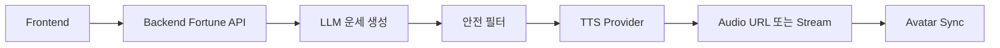

# 오늘신당 서비스 기획 문서

## 1. 서비스 개요

`오늘신당`은 K-pop 판타지 무대 감성과 한국 무속 모티프를 결합한 모바일 웹/PWA 운세 서비스다. 사용자는 여러 명의 "AI 무당 캐릭터" 중 한 명을 선택하고, 선택한 무당이 자연스럽게 움직이며 오늘의 운세를 음성으로 들려준다.

핵심 경험은 "운세를 읽는 앱"이 아니라 "나만을 위한 짧은 굿/무대 퍼포먼스를 보는 앱"이다.

## 2. 기획 배경

점신은 오늘의 운세, 시간대별 흐름, 애정·금전·건강운, 행운 아이템, 전문가 상담, 타로 등 운세 콘텐츠를 폭넓게 제공한다. 다만 광고와 반응성에 대한 불만도 보여, 우리 서비스는 강제 광고보다 몰입형 캐릭터 경험과 빠른 웹 UX를 차별점으로 둔다.

기리고는 소원을 영상으로 기록하고 저장하는 감성적 의식 경험을 제공한다. 여기서 "소원을 말하고 남긴다"는 행동성을 참고해, 운세 결과를 부적 카드나 짧은 영상으로 저장/공유하는 기능을 설계한다.

KPop Demon Hunters는 K-pop 스타, 초자연적 위협, 팬을 지키는 판타지 감성을 결합한 작품이다. 단, 직접 IP를 차용하지 않고 "K-pop 판타지 퇴마 아이돌 무당"이라는 오리지널 세계관으로 재해석한다.

## 3. 서비스 콘셉트

슬로건: **오늘의 기운을 무대 위에서 듣다.**

포지셔닝: 기존 운세 앱보다 시각적이고, AI 상담보다 가볍고, 캐릭터 콘텐츠보다 개인화된 운세 엔터테인먼트.

톤앤매너: 신비롭지만 무섭지 않게, 화려하지만 과하지 않게, 불안을 자극하기보다 하루 행동을 정리해주는 방향.

## 4. 타깃 사용자

핵심 타깃은 운세, 사주, 타로, K-pop, 캐릭터 콘텐츠에 익숙한 18-35세 모바일 사용자다. 출근 전, 등교 전, 자기 전 1분 안에 오늘의 기분 전환을 원하는 사용자를 우선으로 한다.

보조 타깃은 SNS에 운세 카드, 부적 이미지, 캐릭터 음성 클립을 공유하는 사용자다.

## 5. 핵심 사용자 흐름

1. 오늘의 무당 선택
2. 닉네임, 생년월일, 출생시간 선택 입력
3. 관심 주제 선택: 총운, 연애, 금전, 일/학업, 인간관계
4. 무당 등장 애니메이션
5. AI가 생성한 운세를 무당 TTS 음성으로 재생
6. 텍스트 요약, 행운 색상, 행운 아이템, 피해야 할 행동 표시
7. 부적 카드 저장/공유
8. 내일 다시 보기 유도

## 6. 무당 캐릭터 예시

| 캐릭터 | 콘셉트 | 강점 운세 | 음성/말투 |
| --- | --- | --- | --- |
| 홍연 | 붉은 단청과 무대 의상을 섞은 에너지형 무당 | 연애운, 자신감, 대인관계 | 밝고 리듬감 있는 말투 |
| 소월 | 달빛, 한복 실루엣, 차분한 보컬 톤 | 마음정리, 건강 컨디션, 인간관계 | 낮고 부드러운 위로형 말투 |
| 강림 | 검정/은색 장식, 북 장단, 카리스마 있는 톤 | 일, 학업, 금전운 | 단호하고 자신감 있는 말투 |

각 캐릭터는 다른 음색, 말투, 제스처, 등장 연출, 행운 아이템 체계를 가진다.

## 7. MVP 기능 범위

필수 기능은 무당 선택, 오늘의 운세 생성, TTS 재생, 캐릭터 기본 모션, 결과 카드, 공유 이미지, 하루 1회 무료 운세다.

운세 생성은 완전 랜덤이 아니라 날짜, 사용자 생년월일, 선택 주제, 캐릭터 성격을 seed로 사용해 같은 날에는 일관된 결과가 나오게 한다.

결과는 "총평 2문장 + 분야별 점수 + 오늘의 조언 + 행운 요소" 구조로 고정해 품질을 관리한다.

## 8. 캐릭터 모션 기획

MVP는 2D 리깅 기반으로 시작한다. Rive, Live2D, Spine 중 하나를 사용해 `idle`, `greeting`, `speaking`, `thinking`, `blessing`, `result reaction` 상태를 만든다.

TTS 재생 중에는 Web Audio API로 음량을 분석해 입 모양, 고개 움직임, 눈 깜빡임, 손짓을 동기화한다. 이후 고도화 단계에서 음소 기반 lip-sync와 3D VRM 캐릭터를 검토한다.

## 9. AI/TTS 설계

기본 구조는 다음과 같다.

TTS는 provider adapter 방식으로 추상화한다. OpenAI는 한국어 입력을 포함한 다국어 음성 생성과 스트리밍을 지원하며, ElevenLabs는 `voice_id` 기반 음성 생성과 스트리밍 API를 제공한다. 네이버 CLOVA Voice는 RESTful TTS API를 제공해 한국어 서비스 친화적인 후보로 검토할 수 있다.

커스텀 보이스를 쓸 경우 성우 동의, 음성권 계약, 합성음 고지 문구가 필수다.

## 10. 수익 모델

무료 기능:

- 하루 1회 기본 운세
- 기본 무당 1-2명
- 공유 카드

유료 기능:

- 프리미엄 무당
- 심화 운세
- 월간 운세 리포트
- 음성 다시듣기
- 부적 테마
- 광고 제거

후속 모델:

- 실제 상담사 연결은 2차 이후 검토한다.
- 초반에는 AI 엔터테인먼트 운세에 집중한다.

## 11. 안전/법무 기준

운세는 오락 및 자기성찰 콘텐츠로 고지한다. 의료, 법률, 투자, 진학, 취업 결과를 단정하지 않는다. "오늘 큰 사고가 난다", "이걸 사야 액운을 피한다" 같은 불안 조장 문구는 금지한다.

KPop Demon Hunters의 캐릭터명, 그룹명, 의상, 로고, 고유 설정은 사용하지 않는다. "K-pop + 퇴마 + 한국 전통 미감"의 장르적 영감만 가져간다.

무속 문화는 희화화하지 않고, 실제 무속인을 사칭하지 않는 판타지 캐릭터로 명확히 표현한다.

## 12. 주요 KPI

- D1/D7 재방문율
- 운세 생성 완료율
- TTS 청취 완료율
- 무당별 선택률
- 공유율
- 프리미엄 전환율
- TTS 비용/사용자
- 평균 응답 지연시간

MVP 기준 목표는 TTS 첫 재생까지 3초 이내, 운세 완료율 70% 이상, 공유율 10% 이상으로 둔다.

## 13. 출시 로드맵

| 단계 | 기간 | 목표 |
| --- | --- | --- |
| 1단계 | 2주 | 세계관, 캐릭터 3종, 운세 출력 포맷, UI 와이어프레임 확정 |
| 2단계 | 3-4주 | 웹앱 MVP, AI 운세 API, 기본 TTS, 결과 카드 구현 |
| 3단계 | 2주 | 캐릭터 모션, 립싱크, 공유 이미지, PWA 최적화 |
| 4단계 | 1-2주 | 비공개 테스트, 프롬프트 품질 개선, 비용/응답속도 튜닝 |

## 14. 참고 자료

- [점신 App Store](https://apps.apple.com/kr/app/2026-%EC%A0%90%EC%8B%A0-%EB%B3%91%EC%98%A4%EB%85%84-%EC%8B%A0%EB%85%84%EC%9A%B4%EC%84%B8-%EC%82%AC%EC%A3%BC-%ED%83%80%EB%A1%9C-%EC%83%81%EB%8B%B4/id960571015)
- [기리고 App Store](https://apps.apple.com/kr/app/%EA%B8%B0%EB%A6%AC%EA%B3%A0/id6749406672)
- [Netflix KPop Demon Hunters](https://www.netflix.com/title/81498621)
- [OpenAI TTS Docs](https://developers.openai.com/api/docs/guides/text-to-speech)
- [ElevenLabs TTS API](https://elevenlabs.io/docs/api-reference/text-to-speech/convert)
- [NAVER Cloud CLOVA Voice](https://api-gov.ncloud-docs.com/docs/ai-naver-clovavoice)
