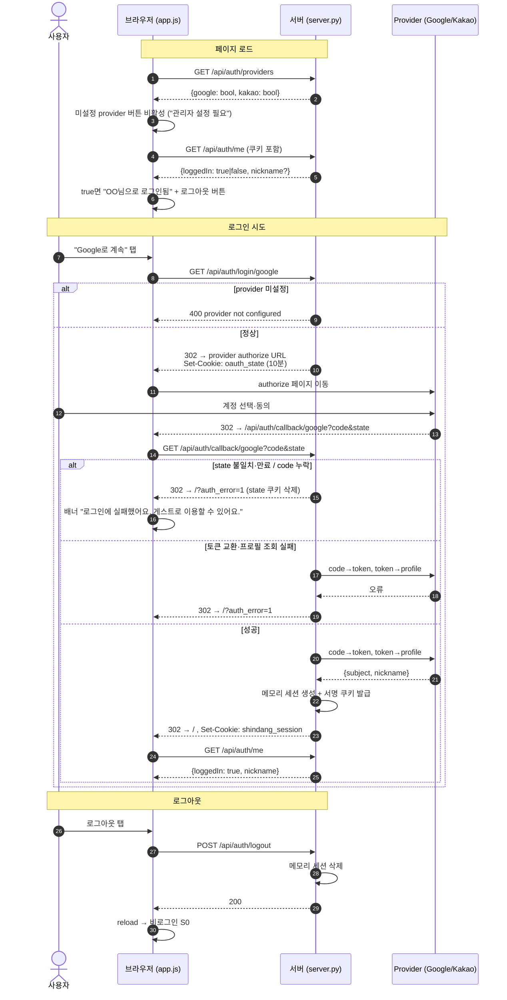

# 로그인 절차 — 시퀀스 & 사용자 시나리오

> 기준: 현재 구현 (`web/server.py` OAuth 스캐폴드 + `static/app.js`, 2026-07-08 auth_error 리다이렉트 반영)
> 원칙: 게스트 우선 (Plan.md "첫 운세는 비회원 가능", v3 §12 비회원 로컬 우선) — 로그인은 선택이며, 운세 흐름은 로그인과 독립.

## 1. 구성 요소

| 요소 | 역할 |
|---|---|
| 브라우저 (app.js) | S0 버튼 노출/상태 표시. 프로필·streak은 localStorage (서버 전송 없음) |
| 서버 (server.py) | OAuth 중개. 세션은 **메모리 + HMAC 서명 쿠키** (`shindang_session`), DB 없음 (§3 hold) |
| Provider | Google / Kakao OAuth 2.0 (env에 client_id/secret 설정 시에만 활성) |

쿠키 2종: `shindang_oauth_state` (CSRF 방지, HttpOnly, 10분) · `shindang_session` (서명 세션 ID, HttpOnly, SameSite=Lax).

## 2. 시퀀스 다이어그램

## 3. 사용자 시나리오

**US-1 · 첫 방문, 게스트로 시작 (기본 경로)**
S0에서 "게스트로 시작" 탭 → S2에서 닉네임·생년월일·시진 입력 → localStorage에만 저장 → **운세 텍스트(카드)까지 이용 가능**. 재생(듣기)·부적 받기는 로그인 필요 — 탭 시 로그인 유도 모달("로그인이 필요해요")이 뜨고, "나중에 할게요"로 닫으면 텍스트 운세는 계속 볼 수 있다. 개인화는 로그인이 아니라 S2 프로필에서 나온다.

**US-2 · 첫 방문, 소셜 로그인 성공**
S0에서 "Google로 계속" 탭 → 구글 동의 → 앱 복귀 → 상단 "OO님으로 로그인됨" + 로그아웃 버튼. 이후 흐름은 게스트와 동일 (현재 로그인 혜택은 세션 표시뿐, 서버 저장·streak 연동은 후속 티켓).

**US-3 · provider 키 미설정 (현재 배포 상태)**
버튼이 비활성으로 보이고 툴팁 "관리자 설정 필요". URL로 직접 쳐도 서버가 400으로 차단 — 이중 차단.

**US-4 · 로그인 실패**
동의 취소(code 누락), state 쿠키 만료(10분)·불일치, 토큰 교환/프로필 조회 실패 — 어느 경우든 `/?auth_error=1`로 복귀해 배너 "로그인에 실패했어요. 게스트로 이용할 수 있어요."가 뜨고 URL은 즉시 `/`로 정리된다. 세션 쿠키는 발급되지 않고, localStorage 프로필은 무관하므로 **잃는 것 없이 게스트로 계속**된다.

**US-5 · 재방문, 세션 유효**
페이지 로드 시 `/api/auth/me`가 loggedIn: true → 자동으로 로그인 상태 표시. 별도 절차 없음.

**US-6 · 재방문, 세션 소멸 (서버 재시작 등)**
세션은 서버 메모리에만 있어 재시작 시 소멸. me가 loggedIn: false → 로그인 버튼 재노출. 프로필은 localStorage에 살아 있어 운세는 재입력 없이 이어진다.

**US-7 · 로그아웃**
로그아웃 탭 → 서버 세션 삭제 → 새로고침 → 비로그인 S0. 프로필·streak은 유지 (로컬 데이터라 로그아웃과 무관).

**US-8 · 재방문자 로그인 진입점 (해결됨, 2026-07-08)**
메인 화면 우측 상단에 계정 바 추가: 비로그인 시 "로그인" 링크(→ 로그인 유도 모달), 로그인 시 "OO님" + 로그아웃. 재생·부적 게이트 모달과 동일한 provider 버튼을 공유하며, provider 미설정 시 비활성("관리자 설정 필요")로 표시된다.

**US-9 · 비로그인 상태에서 재생·부적 시도 (게이트)**
게스트가 듣기/일시정지/다시 듣기/부적 받기를 탭하면 액션 대신 로그인 유도 모달이 뜬다. Google/카카오 버튼(설정 시 활성)과 "나중에 할게요"(닫기)를 제공하고, `login_prompt_shown` 이벤트가 로깅된다. 서버 측에서도 동일 정책을 강제한다: `/audio/mock/*`·`/audio/real/*`·`/api/share-card`는 세션 없으면 **401 login required** (URL 직접 접근 차단). `/api/fortune/today`(운세 텍스트)는 게스트 허용 유지.

## 4. 보안 메모

state는 `secrets.token_hex(16)` + HMAC 비교(`hmac.compare_digest`), 쿠키는 HttpOnly·SameSite=Lax. 토큰 교환 실패 시 키 원문은 로그에 남기지 않는다. 서버 재시작 시 `session_secret` 재생성으로 이전 세션 쿠키는 자동 무효화 — 잔존물 없음.
