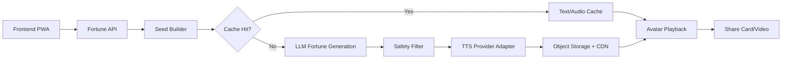

# 오늘신당 서비스 기획 문서 v2

작성일: 2026-05-22  
문서 목적: 출시 전 의사결정, MVP 범위 확정, 비용/리스크 방어 전략 정리

## 0. v2 개정 요약

v1의 콘셉트, 타깃, 사용자 흐름, MVP 범위, 법무 기준은 유지하되 출시 전 반드시 결정해야 할 항목을 보강한다.

- 단위 경제: LLM/TTS 호출 비용, 무료 사용자 변동비, 프리미엄 전환율, ARPU 기준의 손익 가설을 추가한다.
- 캐싱 전략: 결정론적 seed 구조를 비용 절감과 응답속도 개선에 연결한다.
- 방어 가능성: 캐릭터 IP, 누적 개인화, 공유 루프를 핵심 해자로 정의한다.
- 리텐션: streak, 캐릭터 친밀도, 웹 푸시, 주간 리포트 루프를 설계한다.
- 컴플라이언스: 생년월일/출생시간 처리, 미성년자, 결제/환불, 합성음 고지를 추가한다.
- 실행 계획: 3종 캐릭터 동시 출시를 축소하고, 1차 출시는 1-2종 캐릭터와 음량 기반 립싱크까지로 제한한다.

## 1. 서비스 정의

`오늘신당`은 K-pop 판타지 무대 감성과 한국 무속 모티프를 결합한 모바일 웹/PWA 운세 서비스다. 사용자는 여러 명의 "AI 무당 캐릭터" 중 한 명을 선택하고, 선택한 캐릭터가 자연스럽게 움직이며 오늘의 운세를 음성으로 들려준다.

핵심 경험은 "운세를 읽는 앱"이 아니라 "나만을 위한 짧은 굿/무대 퍼포먼스를 보는 앱"이다.

## 2. 기획 배경

국내 운세 앱 시장은 이미 사주, 타로, 궁합, 오늘의 운세, 상담, 챗봇 형태로 충분히 성숙해 있다. 따라서 `오늘신당`은 운세 정확도만으로 경쟁하지 않는다. 사용자가 매일 다시 들어오고, 캐릭터를 고르고, 음성을 듣고, 결과를 공유하게 만드는 엔터테인먼트형 운세 경험을 목표로 한다.

서비스의 기본 전제는 다음과 같다.

- 운세 콘텐츠는 오락과 자기성찰의 도구다.
- 사용자는 "정답"보다 "나에게 말해주는 느낌"을 원한다.
- TTS와 캐릭터 모션은 비용이 아니라 제품의 핵심 차별점이다.
- 그러나 TTS/LLM 비용을 통제하지 못하면 DAU 증가가 곧 손실 증가로 이어진다.

## 3. 시장 및 경쟁 분석

| 서비스 | 관찰 포인트 | 강점 | 약점/공략 지점 |
| --- | --- | --- | --- |
| 점신 | 오늘의 운세, 사주, 타로, 상담 등 종합 운세 앱 | 콘텐츠 폭이 넓고 인지도가 높음 | 광고 피로와 앱 중심 UX가 약점이 될 수 있음 |
| 포스텔러 | 오늘의 운세 점수, 운세 캘린더, 길일 계산, 사주/타로/궁합 | 일정과 의사결정에 붙는 실용형 운세 | 캐릭터 음성 퍼포먼스 경험은 제한적 |
| 헬로우봇/라마마 | 사주, 타로, AI 채팅, 챗봇 캐릭터, 월 구독 | 대화형 운세와 캐릭터 친밀감 | 무대형 시청각 퍼포먼스와 공유 영상화는 별도 영역 |
| 기리고 | 소원을 영상으로 기록하고 저장하는 감성적 의식 경험 | 소원 기록, 감정 저장, 의례적 UX | 매일 반복되는 운세 리텐션과 캐릭터 선택 경험은 약함 |
| 오늘신당 | AI 무당 캐릭터가 움직이고 말해주는 오늘의 운세 | 음성, 모션, 캐릭터 팬덤, 공유 카드/영상 | 원가 구조와 콘텐츠 품질 관리가 핵심 리스크 |

포지셔닝 문장:

> 점신/포스텔러가 "운세 정보 플랫폼"이고 헬로우봇이 "운세 챗봇"이라면, 오늘신당은 "매일 1분짜리 캐릭터 운세 공연"이다.

## 4. 서비스 콘셉트

슬로건: **오늘의 기운을 무대 위에서 듣다.**

서비스 톤:

- 신비롭지만 무섭지 않게
- 화려하지만 과하지 않게
- 불안을 자극하기보다 하루 행동을 정리해주는 방향
- 실제 무속인을 사칭하지 않는 판타지 캐릭터 기반

IP 원칙:

- `KPop Demon Hunters`의 캐릭터명, 그룹명, 로고, 의상, 고유 설정을 사용하지 않는다.
- 장르적 영감은 "K-pop 무대 감성 + 한국 전통 미감 + 퇴마 판타지" 수준으로 제한한다.
- 서비스 세계관과 캐릭터는 자체 IP로 설계한다.

## 5. 타깃 사용자

핵심 타깃은 운세, 사주, 타로, K-pop, 캐릭터 콘텐츠에 익숙한 18-35세 모바일 사용자다. 출근 전, 등교 전, 자기 전 1분 안에 오늘의 기분 전환을 원하는 사용자를 우선으로 한다.

세부 세그먼트:

| 세그먼트 | 니즈 | 주요 기능 |
| --- | --- | --- |
| 데일리 운세형 | 오늘 하루의 분위기와 조언 확인 | 오늘 운세, 행운 색상, 피해야 할 행동 |
| 캐릭터 팬덤형 | 캐릭터 목소리와 반응 수집 | 무당 선택, 친밀도, 음성 클립 |
| 공유형 | SNS에 예쁜 결과물을 올림 | 부적 카드, 짧은 영상, 친구 궁합 |
| 자기정리형 | 고민을 가볍게 정리 | 주제 선택, 주간 리포트, 기록 |

## 6. 핵심 사용자 흐름

1. 오늘의 무당 선택
2. 닉네임, 생년월일, 출생시간 선택 입력
3. 관심 주제 선택: 총운, 연애, 금전, 일/학업, 인간관계
4. 무당 등장 애니메이션
5. AI가 생성한 운세를 무당 TTS 음성으로 재생
6. 텍스트 요약, 분야별 점수, 행운 색상, 행운 아이템, 피해야 할 행동 표시
7. 부적 카드 또는 짧은 영상 저장/공유
8. streak, 캐릭터 친밀도, 내일 알림으로 재방문 유도

MVP에서는 회원가입 없이도 첫 운세를 볼 수 있게 한다. 단, streak, 캐릭터 친밀도, 저장함, 결제 기능은 계정 또는 기기 기반 식별이 필요하다.

## 7. 무당 캐릭터 전략

1차 출시는 캐릭터 1-2종으로 제한한다. 캐릭터 3종 동시 제작은 일러스트, 리깅, 모션, 음성, 말투 QA 비용이 커서 MVP 리스크가 높다.

| 캐릭터 | 출시 | 콘셉트 | 강점 운세 | 음성/말투 |
| --- | --- | --- | --- | --- |
| 홍연 | MVP 기본 | 붉은 단청과 무대 의상을 섞은 에너지형 무당 | 연애운, 자신감, 대인관계 | 밝고 리듬감 있는 말투 |
| 소월 | MVP 또는 v1.1 | 달빛, 한복 실루엣, 차분한 보컬 톤 | 마음정리, 건강 컨디션, 인간관계 | 낮고 부드러운 위로형 말투 |
| 강림 | 프리미엄 후보 | 검정/은색 장식, 북 장단, 카리스마 있는 톤 | 일, 학업, 금전운 | 단호하고 자신감 있는 말투 |

캐릭터 해자 전략:

- 캐릭터별 말투, 금기어, 행운 아이템, 등장 연출을 고정해 일관성을 만든다.
- 음성 클립, 부적 카드, 시즌 의상, 생일 이벤트로 팬덤 자산을 축적한다.
- 캐릭터 친밀도에 따라 인사말과 짧은 리액션을 해금한다.
- 캐릭터 자체 IP를 상표, 아트워크, 보이스 계약 측면에서 관리한다.

## 8. MVP 기능 범위

필수 기능:

- 무당 선택
- 오늘의 운세 생성
- TTS 재생
- 캐릭터 기본 모션
- 음량 기반 입 모양 동기화
- 결과 카드
- 공유 이미지
- 하루 1회 무료 운세
- 기본 이벤트 분석

MVP에서 제외:

- 음소 기반 정밀 립싱크
- 실시간 대화형 상담
- 3D VRM 캐릭터
- 실제 무속인/상담사 연결
- 캐릭터 3종 이상 동시 운영
- 장문 월간 리포트 무제한 생성

## 9. 운세 생성 정책

운세 생성은 완전 랜덤이 아니라 날짜, 사용자 입력, 선택 주제, 캐릭터 성격을 seed로 사용한다. 같은 날 같은 조건이면 같은 결과가 나오게 하되, 사용자에게는 자연스럽고 개인화된 문장으로 전달한다.

결과 구조:

- 총평 2문장
- 분야별 점수: 연애, 금전, 일/학업, 인간관계, 컨디션
- 오늘의 조언 1개
- 행운 색상
- 행운 아이템
- 피해야 할 행동
- 캐릭터별 짧은 축원 문장

콘텐츠 품질 원칙:

- 불안을 자극하지 않는다.
- 특정 행동을 강요하지 않는다.
- 의료, 법률, 투자, 진학, 취업 결과를 단정하지 않는다.
- 사용자가 오늘 바로 실천할 수 있는 작은 행동을 제안한다.
- "누구에게나 맞는 일반론" 비율을 낮추기 위해 생년월일, 날짜, 주제, 최근 선택 기록을 문장에 반영한다.

## 10. AI/TTS 기술 설계

기본 구조는 다음과 같다.



TTS provider는 adapter 방식으로 추상화한다.

- OpenAI: 한국어 입력을 포함한 다국어 음성 생성과 스트리밍 후보
- ElevenLabs: 캐릭터 음색 커스터마이징과 감정 표현 후보
- NAVER CLOVA Voice: 한국어 서비스 친화적인 후보

커스텀 보이스를 쓸 경우 성우 동의, 음성권 계약, 합성음 고지 문구가 필수다.

## 11. 캐싱 및 비용 절감 전략

결정론적 seed는 제품 품질뿐 아니라 원가 절감의 핵심이다. 같은 입력에서 같은 결과가 나온다면 텍스트와 음성을 다시 생성할 필요가 없다.

캐시 키 예시:

```text
fortune:v1:{date}:{birth_profile_hash}:{topic}:{character_id}:{tone}:{locale}
tts:v1:{provider}:{voice_id}:{script_hash}:{speed}:{emotion}
```

캐싱 계층:

| 계층 | 대상 | 목적 |
| --- | --- | --- |
| 사전 합성 음성 | 인사, 전환, 축원, 엔딩 문장 | TTS 호출 감소, 첫 재생 속도 개선 |
| 텍스트 캐시 | seed 기반 운세 JSON | LLM 호출 감소 |
| TTS 세그먼트 캐시 | 문장 단위 음성 파일 | 동일 문장 재사용 |
| CDN 캐시 | 완성 음성 파일과 공유 이미지 | 재방문/공유 트래픽 비용 절감 |
| 클라이언트 캐시 | 당일 결과와 오디오 | 뒤로가기/다시듣기 지연 감소 |

개인정보 보호를 위해 캐시 키에는 원본 생년월일과 출생시간을 넣지 않는다. 서버 secret을 사용한 HMAC 또는 별도 프로필 해시를 사용한다. 닉네임이 들어가는 문장은 캐시 효율을 떨어뜨리므로, MVP에서는 닉네임을 화면 텍스트에만 반영하거나 짧은 별도 세그먼트로 분리한다.

운영 목표:

- 무료 운세 TTS 길이: 45-60초
- TTS 첫 재생: 3초 이내
- TTS 캐시 히트율: 베타 30% 이상, 정식 출시 후 60% 이상
- LLM 재생성 비율: 동일 날짜/동일 seed 기준 5% 미만

## 12. 단위 경제 가설

무료 사용자는 DAU가 늘수록 LLM/TTS 비용을 발생시키므로, 출시 전 아래 식을 기준으로 손익 구조를 검증한다.

```text
무료 사용자 1인 일일 변동비
= (LLM 신규 생성률 * LLM 1회 비용)
+ (TTS 캐시 미스율 * TTS 1회 비용)
+ CDN/스토리지/서버 비용

월 무료 사용자 변동비
= Free DAU * 무료 사용자 1인 일일 변동비 * 30

월 유료 매출
= MAU * 유료 전환율 * 월 ARPU * PG/스토어 수수료 차감률

운영 가능 조건
= 월 유료 매출 >= 월 무료 사용자 변동비 + 고정 운영비
```

가격 가설:

| 상품 | 가격 가설 | 제공 가치 | 비용 통제 |
| --- | --- | --- | --- |
| 무료 | 0원 | 하루 1회 기본 운세, 기본 캐릭터 1종, 공유 카드 | 60초 이하, 캐시 우선 |
| 캐릭터 패스 | 월 2,900-3,900원 | 특정 무당 추가 음성, 시즌 의상, 친밀도 보상 | 동일 캐릭터 음성 재사용 |
| 프리미엄 | 월 6,900-8,900원 | 전체 무당, 다시듣기, 주간 리포트, 광고 없음 | 리포트 횟수 제한 |
| 심화 운세 | 건당 1,900-3,900원 | 연애/금전/학업 심화 리딩 | 유료 요청에만 장문 생성 |

의사결정 기준:

- 무료 운세 1회 원가가 예상 광고/바이럴 가치보다 높으면 무료 TTS 길이를 줄인다.
- 캐시 히트율이 30% 미만이면 캐릭터별 공통 문장 비중을 높인다.
- 유료 전환율이 낮으면 캐릭터 해금보다 결과 저장/주간 리포트 가치를 먼저 검증한다.

## 13. 수익 모델

무료 기능:

- 하루 1회 기본 운세
- 기본 무당 1종
- 결과 카드 저장/공유
- 당일 1회 다시듣기

유료 기능:

- 프리미엄 무당
- 심화 운세
- 주간/월간 운세 리포트
- 음성 다시듣기 저장함
- 부적 카드 테마
- 시즌 의상과 한정 리액션

후속 모델:

- 실제 상담사 연결은 2차 이후 검토한다.
- 초반에는 AI 엔터테인먼트 운세에 집중한다.
- 굿즈, 스티커, 음성팩은 캐릭터 팬덤 지표가 확인된 이후 확장한다.

## 14. 리텐션 루프

`오늘신당`은 하루 1회 운세 구조이므로 리텐션 루프와 궁합이 좋다. "내일 다시 보기" 한 줄이 아니라 제품 구조 안에 반복 방문 이유를 심어야 한다.

핵심 루프:

1. 오늘 운세를 듣는다.
2. 결과 카드와 행운 아이템을 저장한다.
3. streak와 캐릭터 친밀도가 오른다.
4. 다음 날 캐릭터가 이전 흐름을 짧게 언급한다.
5. 주간 리포트에서 7일의 운세 흐름을 요약한다.

기능 설계:

| 기능 | MVP 포함 | 설명 |
| --- | --- | --- |
| 출석 streak | 포함 | 3일, 7일, 14일 단위 보상 |
| 캐릭터 친밀도 | v1.1 | 반복 선택한 무당의 인사말과 리액션 해금 |
| 웹 푸시 | v1.1 | 운세 청취 후 권한 요청, 불안 조장 문구 금지 |
| 주간 리포트 | v1.2 | 7일 운세와 기분 기록 요약 |
| 행운 미션 | v1.1 | "오늘 파란색 물건 챙기기" 같은 가벼운 행동 |

푸시 알림 원칙:

- "나쁜 일이 생긴다" 식의 공포 메시지를 금지한다.
- 권한 요청은 첫 방문이 아니라 운세 청취 완료 후에 노출한다.
- 알림 빈도는 기본 1일 1회 이하로 제한한다.

예시 카피:

- "홍연이 오늘의 첫 기운을 준비했어요."
- "소월의 조용한 조언이 도착했어요."
- "오늘의 행운 색상이 열렸어요."

## 15. 공유 및 바이럴 전략

공유는 단순 부가 기능이 아니라 유입 루프다.

공유 포맷:

- 정적 부적 카드: 행운 색상, 점수, 한 줄 조언
- 짧은 영상: 캐릭터 3-5초 리액션 + 오늘의 한 문장
- 친구 궁합 카드: 두 사용자의 오늘 기운 비교
- 캐릭터 음성 클립: 유료 또는 이벤트성 공유

공유 카드에는 서비스명, 캐릭터명, QR/딥링크를 넣되 과도한 워터마크는 피한다. SNS에 올렸을 때 "운세 결과"보다 "예쁜 캐릭터 콘텐츠"로 보이게 만드는 것이 목표다.

## 16. 측정 인프라와 품질 평가

KPI:

- D1/D7/D30 재방문율
- 운세 생성 완료율
- TTS 첫 재생 시간
- TTS 청취 완료율
- 무당별 선택률
- 공유율
- 웹 푸시 opt-in율
- 유료 전환율
- TTS 비용/사용자
- 캐시 히트율

핵심 이벤트:

| 이벤트 | 설명 |
| --- | --- |
| `fortune_start` | 운세 생성 시작 |
| `fortune_complete` | 운세 생성 완료 |
| `tts_play_start` | TTS 첫 재생 |
| `tts_play_complete` | TTS 80% 이상 청취 |
| `character_select` | 무당 선택 |
| `share_card_create` | 공유 카드 생성 |
| `share_click` | 공유 실행 |
| `push_permission_prompt` | 푸시 권한 요청 노출 |
| `push_permission_grant` | 푸시 권한 허용 |
| `premium_view` | 유료 상품 화면 진입 |
| `purchase_complete` | 결제 완료 |

프롬프트 품질 평가 기준:

| 기준 | 설명 |
| --- | --- |
| 개인화감 | 사용자 입력과 날짜/주제가 실제 문장에 반영되는가 |
| 행동성 | 오늘 바로 할 수 있는 조언이 있는가 |
| 안전성 | 불안 조장, 단정적 예언, 의료/법률/투자 조언이 없는가 |
| 캐릭터성 | 선택한 무당의 말투가 일관되는가 |
| 반복감 | 전날/다른 캐릭터와 지나치게 비슷하지 않은가 |
| 길이 | 45-60초 TTS에 맞게 압축되는가 |

A/B 테스트 후보:

- 캐릭터 선택을 먼저 보여줄지, 생년월일 입력을 먼저 받을지
- TTS 자동 재생 대신 탭 후 재생을 기본으로 할지
- 무료 캐릭터 1종과 2종 중 어느 쪽이 전환율에 유리한지
- 공유 카드를 점수 중심으로 할지, 한 줄 조언 중심으로 할지

## 17. 안전/법무/컴플라이언스

운세 면책:

- 운세는 오락 및 자기성찰 콘텐츠로 고지한다.
- 의료, 법률, 투자, 진학, 취업 결과를 단정하지 않는다.
- "오늘 큰 사고가 난다", "이걸 사야 액운을 피한다" 같은 불안 조장 문구는 금지한다.

개인정보:

- 생년월일과 출생시간은 수집 최소화 원칙으로 처리한다.
- MVP에서는 비회원 로컬 저장을 우선 검토한다.
- 서버 저장이 필요할 경우 암호화 저장, 별도 동의, 보관 기간, 삭제 기능을 제공한다.
- 캐시 키에는 원본 생년월일/출생시간을 넣지 않는다.
- 이용자는 자신의 정보 열람, 수정, 삭제, 처리정지를 요청할 수 있어야 한다.

미성년자:

- 기본 타깃은 18세 이상으로 둔다.
- 14세 미만 이용은 원칙적으로 제한하거나 법정대리인 동의 체계를 별도로 설계한다.
- 미성년자 결제는 보호자 동의, 결제 한도, 환불 정책을 명확히 고지한다.

결제/환불:

- PWA에서 자체 PG를 사용할 경우 통신판매, 청약철회, 환불, 사업자 정보, 이용약관, 개인정보처리방침 고지가 필요하다.
- 디지털 콘텐츠의 즉시 제공, 청약철회 제한 조건, 구독 해지 방법을 결제 전에 명확히 표시한다.
- 회원탈퇴, 구독해지, 동의철회는 온라인에서 쉽게 가능해야 한다.

AI/TTS:

- 합성음 사용 사실을 고지한다.
- 성우 또는 보이스 모델 계약 범위, 사용 기간, 2차 활용 범위를 문서화한다.
- 특정 실존 인물의 목소리를 모사하지 않는다.

문화 표현:

- 무속 문화를 희화화하지 않는다.
- 실제 굿, 점사, 신내림을 과장된 공포 콘텐츠로 소비하지 않는다.
- 캐릭터는 "판타지 무당" 또는 "무속 모티프의 가상 퍼포머"로 명확히 표현한다.

## 18. 기술 스택 제안

MVP 추천 스택:

| 영역 | 제안 | 이유 |
| --- | --- | --- |
| Frontend | Next.js 또는 Vite React + TypeScript | PWA, 빠른 실험, 공유 페이지 SEO 대응 |
| Styling | Tailwind CSS 또는 CSS Modules | 모바일 UI 빠른 구현 |
| Animation | Rive 또는 Live2D | 2D 캐릭터 idle/speaking 모션에 적합 |
| Audio Sync | Web Audio API | 음량 기반 입 모양 동기화 구현 |
| Backend | Next.js Route Handler 또는 Fastify/NestJS | API와 프론트 통합 운영 가능 |
| DB | PostgreSQL + Prisma | 사용자, 구매, 결과 기록 관리 |
| Cache | Redis | seed 결과와 TTS 작업 상태 캐싱 |
| Storage | S3/R2 호환 Object Storage + CDN | 음성 파일, 공유 이미지 저장 |
| Queue | BullMQ 또는 managed queue | TTS 생성과 공유 이미지 렌더링 비동기 처리 |
| Analytics | PostHog, Amplitude, GA4 중 1개 | 이벤트 분석, 퍼널, A/B 테스트 |
| Payment | 국내 PG 연동 | PWA 자체 결제, 환불 처리 |

Unity WebGL은 캐릭터 연출에는 매력적이지만 초기 로딩과 모바일 성능 부담이 크다. MVP는 2D 웹 애니메이션으로 시작하고, Unity 기반 연출은 프로모션 페이지나 고사양 버전에서 별도로 검토한다.

## 19. 출시 로드맵 v2

| 단계 | 기간 | 목표 | 산출물 |
| --- | --- | --- | --- |
| 0단계 | 1주 | 비용/법무/캐릭터 범위 확정 | 원가 시뮬레이션, 개인정보 플로우, 캐릭터 1-2종 결정 |
| 1단계 | 2주 | 세계관과 UX 설계 | 캐릭터 시트, 운세 JSON 스키마, 와이어프레임 |
| 2단계 | 4주 | 웹앱 MVP 구현 | 무당 선택, 운세 생성, TTS, 결과 카드 |
| 3단계 | 3주 | 캐릭터 모션과 공유 고도화 | idle/speaking 모션, 음량 기반 립싱크, 공유 이미지 |
| 4단계 | 2주 | 비공개 베타 | 비용 측정, 프롬프트 QA, 이벤트 분석 |
| 5단계 | 2주 | 수익화 실험 | 캐릭터 패스, 심화 운세, 결제/환불 플로우 |

로드맵 원칙:

- 1차 출시는 캐릭터 1-2종만 사용한다.
- 3단계의 립싱크는 음량 기반까지만 목표로 한다.
- 음소 기반 립싱크와 3D 캐릭터는 정식 출시 이후 검토한다.
- 비용/캐시 지표가 기준 미달이면 마케팅 집행을 늦춘다.

## 20. 리스크 등록부

| 리스크 | 영향 | 대응 |
| --- | --- | --- |
| TTS/LLM 비용 초과 | DAU 증가 시 손실 확대 | seed 캐싱, 사전 합성, 무료 TTS 길이 제한 |
| 캐릭터 제작 지연 | 출시 일정 지연 | 1-2종 출시, 모션 상태 최소화 |
| IP 유사성 논란 | 법무/브랜드 리스크 | 오리지널 세계관, 의상/명칭/로고 검수 |
| 개인정보 처리 미흡 | 법적 리스크 | 로컬 우선, 암호화, 삭제 기능, 동의 플로우 |
| 운세 문장 품질 저하 | 재방문율 하락 | 평가 루브릭, 샘플 QA, A/B 테스트 |
| 푸시 알림 거부 | 리텐션 저하 | 청취 완료 후 요청, 가치 기반 카피 |
| 결제/환불 불만 | CS 비용 증가 | 상품 설명, 청약철회 제한 고지, 간단한 해지 |
| 문화적 표현 논란 | 브랜드 신뢰 하락 | 자문 검토, 희화화 금지, 판타지 고지 |

## 21. 출시 전 의사결정 체크리스트

- 무료 운세 TTS 길이를 몇 초로 제한할 것인가?
- MVP 캐릭터를 1종으로 할 것인가, 2종으로 할 것인가?
- 생년월일/출생시간을 서버에 저장할 것인가, 로컬에만 둘 것인가?
- 결제는 PWA 자체 PG로 갈 것인가, 앱 출시 후 인앱결제로 갈 것인가?
- 공유 카드는 정적 이미지부터 할 것인가, 짧은 영상까지 할 것인가?
- 첫 유료 상품은 캐릭터 패스인가, 심화 운세인가?
- 캐릭터 보이스는 TTS 기본 음색인가, 계약 기반 커스텀 보이스인가?

## 22. 참고 자료

- [점신 App Store](https://apps.apple.com/kr/app/2026-%EC%A0%90%EC%8B%A0-%EB%B3%91%EC%98%A4%EB%85%84-%EC%8B%A0%EB%85%84%EC%9A%B4%EC%84%B8-%EC%82%AC%EC%A3%BC-%ED%83%80%EB%A1%9C-%EC%83%81%EB%8B%B4/id960571015)
- [기리고 App Store](https://apps.apple.com/kr/app/%EA%B8%B0%EB%A6%AC%EA%B3%A0/id6749406672)
- [Netflix KPop Demon Hunters](https://www.netflix.com/title/81498621)
- [포스텔러 Google Play](https://play.google.com/store/apps/details?hl=ko&id=com.un7qi3.forceteller)
- [헬로우봇 App Store](https://apps.apple.com/kr/app/%ED%97%AC%EB%A1%9C%EC%9A%B0%EB%B4%87-2026-%EC%8B%A0%EB%85%84%EC%9A%B4%EC%84%B8-%EC%82%AC%EC%A3%BC%ED%83%80%EB%A1%9C-%EC%9A%B4%EC%84%B8-%EB%A7%8C%EC%84%B8%EB%A0%A5/id1294957719)
- [OpenAI GPT-4o mini TTS model docs](https://developers.openai.com/api/docs/models/gpt-4o-mini-tts)
- [OpenAI API pricing](https://openai.com/api/pricing/)
- [ElevenLabs API pricing help](https://help.elevenlabs.io/hc/en-us/articles/28184926326033-How-much-does-it-cost-to-use-the-API)
- [NAVER Cloud CLOVA Voice pricing page](https://www.gov-ncloud.com/charge/price/ko)
- [개인정보 보호법 제15조](https://www.law.go.kr/lsLinkCommonInfo.do?ancYnChk=&chrClsCd=010202&lsJoLnkSeq=1020398549)
- [전자상거래 등에서의 소비자보호에 관한 법률](https://www.law.go.kr/LSW/lsRvsDocListP.do?chrClsCd=010202&lsId=009318&lsRvsGubun=all)
