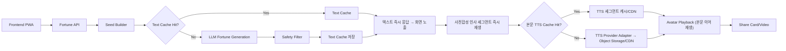

# 오늘신당 서비스 기획 문서 v3

작성일: 2026-05-22
이전 버전: `today-shindang-service-plan-v2.md`(v2), `today-shindang-service-plan.md`(v1)
문서 목적: v2 검토(P1/P2) 결과를 반영해 "사업 기획서"에서 "착수 가능 문서"로 전환

## 0. v3 개정 요약

v3는 v2의 콘셉트·타깃·법무 기준을 유지하되, v2 검토에서 지적된 미결 항목을 결정값으로 닫는다. 핵심 변경은 다음과 같다.

- **3초 재생 경로 확정**: 사전합성 세그먼트 우선 + 텍스트 먼저 노출 방식으로 고정한다. cache miss 시에도 첫 화면 체감 지연을 분리한다. (v2 P1 #1 해소, §10·§11)
- **개인정보 처리 경로 단일화**: 생년월일/최근 선택 기록을 **서버 저장(동의 기반)** 으로 확정하고, 캐시 키는 HMAC 해시만 사용하는 분리 구조를 명문화한다. (v2 P1 #2 해소, §12·§18)
- **단위 경제 숫자표 추가**: 공개 가격 기반으로 LLM/TTS 단가를 추정하고 1k/10k/50k DAU 손익·break-even 표를 넣는다. (v2 P1 #3 해소, §13)
- **MVP/후속 재방문 장치 분리**: 핵심 흐름과 실제 MVP 구현 범위의 streak/친밀도/푸시/리포트를 분리 표로 정리한다. (v2 P2 해소, §9·§15)
- **모바일 오디오 정책 리스크 명문화**: autoplay 정책을 A/B가 아닌 기본 설계 전제로 끌어올린다. 첫 재생은 사용자 탭으로 오디오 컨텍스트를 연다. (v2 P2 해소, §11)
- **실패/지연 측정 이벤트 보강**: `fortune_fail`, `tts_generate_start/complete`, `tts_play_error`, `cache_hit/miss`, `share_fail` 추가. (v2 P2 해소, §17)
- **베타 캐릭터 1종(홍연) 고정**: 첫 베타는 캐릭터 선택 재미보다 핵심 루프·원가·품질 검증을 우선한다. 2종 선택 재미는 v1.1에서 A/B로 검증한다. (Open Question 해소, §7)

미해소로 남겨 추후 입력이 필요한 항목은 §13의 사내 실측 단가, §19의 고정 운영비, 그리고 §22 체크리스트에 명시한다.

## 1. 서비스 정의

`오늘신당`은 K-pop 판타지 무대 감성과 한국 무속 모티프를 결합한 모바일 웹/PWA 운세 서비스다. 사용자는 AI 무당 캐릭터를 선택하고, 캐릭터가 자연스럽게 움직이며 오늘의 운세를 음성으로 들려준다.

핵심 경험은 "운세를 읽는 앱"이 아니라 "나만을 위한 짧은 굿/무대 퍼포먼스를 보는 앱"이다.

## 2. 기획 배경

국내 운세 앱 시장은 사주, 타로, 궁합, 오늘의 운세, 상담, 챗봇 형태로 이미 성숙해 있다. `오늘신당`은 운세 정확도만으로 경쟁하지 않고, 매일 다시 들어와 캐릭터를 고르고 음성을 듣고 결과를 공유하는 엔터테인먼트형 운세 경험을 목표로 한다.

기본 전제:

- 운세 콘텐츠는 오락과 자기성찰의 도구다.
- 사용자는 "정답"보다 "나에게 말해주는 느낌"을 원한다.
- TTS와 캐릭터 모션은 비용이 아니라 제품의 핵심 차별점이다.
- 그러나 TTS/LLM 비용을 통제하지 못하면 DAU 증가가 곧 손실 증가로 이어진다. (→ §11 캐싱, §13 단위 경제)

## 3. 시장 및 경쟁 분석

> 2026-06-13 갱신: `경쟁분석-보고서-2026-06-13.md` 반영. 기리고를 직접 경쟁자에서 시장 신호/위협 사례로 재분류, 헬로우봇 가격·모니터링 트리거 추가.

### 3.1 직접 경쟁사

| 서비스 | 관찰 포인트 | 강점 | 약점/공략 지점 |
| --- | --- | --- | --- |
| 점신 | 종합 운세 앱(오늘 운세·사주·타로·상담), 행운패스(광고 제거)·400+ 상담사 과금 | 콘텐츠 폭, 인지도, 상담 ARPU | 광고 피로, 앱 중심 UX |
| 포스텔러 | 운세 점수·캘린더·6개월 미리보기·웰컴 퀘스트·사주/타로/궁합 | 실용형 의사결정 운세, 온보딩·리텐션 설계 | 캐릭터 음성 퍼포먼스 약함 |
| 헬로우봇/라마마 | 사주·타로·AI 채팅·챗봇 캐릭터·구독(정액권 26,000원/월 + 하트 재화) | 대화형·캐릭터 친밀감, 검증된 캐릭터 수익 모델 | 무대형 시청각·영상 공유 약함 |
| 오늘신당 | AI 무당이 움직이고 말하는 오늘의 운세 | 음성·모션·팬덤·공유 카드/영상 | 원가 구조·콘텐츠 품질 관리가 핵심 리스크 |

> 포지셔닝: 점신/포스텔러가 "운세 정보 플랫폼", 헬로우봇이 "운세 챗봇"이라면, 오늘신당은 "매일 1분짜리 캐릭터 운세 공연"이다. (2026-06-13 웹 리서치 기준 동일 포지션 서비스 미확인 — 공백 유효, MVP 범위 변경 없음)

### 3.2 시장 신호·위협 사례

- **기리고**: 넷플릭스 시리즈 「기리고」 홍보용 소품 앱(소원 영상 녹화·갤러리 저장)으로 확인되어 상시 경쟁자가 아니다. 다만 ① "의례적 감성 + 영상 기록" UX의 대중 수요 신호(부적 카드·후속 영상 공유의 근거), ② 대형 콘텐츠 IP가 무속 모티프 × 앱으로 진입할 수 있다는 위협 사례로 관리한다.

### 3.3 모니터링 트리거 (분기 1회 + 신년 시즌 전 재점검)

- **헬로우봇의 TTS/음성 운세 기능 출시** — 최우선 잠재 추격자. 캐릭터 IP·유저 베이스 보유로 최단 거리 추격 가능.
- 엔터사·방송사 등 대형 IP의 운세×캐릭터 앱 발표.
- 점신·포스텔러의 캐릭터 IP 도입.

> 가격/수익성 기준치(유지): 헬로우봇 정액권 26,000원/월, 오늘신당 캐릭터 패스 월 2,900-3,900원(§14), 변동비 break-even 전환율 1.54%(§13).

## 4. 서비스 콘셉트

슬로건: **오늘의 기운을 무대 위에서 듣다.**

톤: 신비롭지만 무섭지 않게 / 화려하지만 과하지 않게 / 불안을 자극하기보다 하루 행동을 정리해주는 방향 / 실제 무속인을 사칭하지 않는 판타지 캐릭터 기반.

IP 원칙: `KPop Demon Hunters`의 캐릭터명·그룹명·로고·의상·고유 설정을 사용하지 않는다. 장르적 영감은 "K-pop 무대 감성 + 한국 전통 미감 + 퇴마 판타지" 수준으로 제한하고, 세계관과 캐릭터는 자체 IP로 설계한다.

## 5. 타깃 사용자

핵심 타깃은 운세·사주·타로·K-pop·캐릭터 콘텐츠에 익숙한 18-35세 모바일 사용자다. 출근/등교/취침 전 1분 안에 기분 전환을 원하는 사용자를 우선으로 한다.

| 세그먼트 | 니즈 | 주요 기능 |
| --- | --- | --- |
| 데일리 운세형 | 오늘의 분위기·조언 | 오늘 운세, 행운 색상, 피해야 할 행동 |
| 캐릭터 팬덤형 | 캐릭터 목소리·반응 수집 | 무당 선택, 친밀도, 음성 클립 |
| 공유형 | SNS에 예쁜 결과물 | 부적 카드, 짧은 영상, 친구 궁합 |
| 자기정리형 | 고민을 가볍게 정리 | 주제 선택, 주간 리포트, 기록 |

## 6. 핵심 사용자 흐름

1. 오늘의 무당 선택 (베타는 홍연 1종 고정 → §7)
2. 닉네임, 생년월일, 출생시간 선택 입력
3. 관심 주제 선택: 총운, 연애, 금전, 일/학업, 인간관계
4. 무당 등장 애니메이션
5. **운세 텍스트 요약 먼저 노출** → 사전합성 인사 음성 즉시 재생 → 개인화 본문 음성 이어 재생 (→ §11)
6. 분야별 점수, 행운 색상, 행운 아이템, 피해야 할 행동 표시
7. 부적 카드 또는 짧은 영상 저장/공유
8. streak, (v1.1)캐릭터 친밀도, (v1.1)내일 알림으로 재방문 유도

MVP에서는 회원가입 없이 첫 운세를 볼 수 있게 한다. 단, 서버 저장 개인화·streak·결제는 계정 또는 기기 식별이 필요하다(→ §12).

## 7. 무당 캐릭터 전략

**첫 베타는 캐릭터 1종(홍연) 고정.** 캐릭터 선택 재미보다 핵심 루프·원가·품질·재생 UX 검증을 우선한다. 2종 선택 재미(전환율·선호도)는 v1.1에서 A/B로 검증한다.

| 캐릭터 | 출시 | 콘셉트 | 강점 운세 | 음성/말투 |
| --- | --- | --- | --- | --- |
| 홍연 | **베타 단독** | 붉은 단청·무대 의상 에너지형 | 연애운, 자신감, 대인관계 | 밝고 리듬감 있는 말투 |
| 소월 | v1.1 (2종 A/B) | 달빛·한복 실루엣·차분한 톤 | 마음정리, 건강, 인간관계 | 낮고 부드러운 위로형 |
| 강림 | 프리미엄 후보 | 검정/은색·북 장단·카리스마 | 일, 학업, 금전운 | 단호하고 자신감 있는 말투 |

캐릭터 해자 전략: 캐릭터별 말투·금기어·행운 아이템·등장 연출 고정, 음성 클립·부적 카드·시즌 의상·생일 이벤트로 팬덤 자산 축적, 친밀도 기반 인사말·리액션 해금, 캐릭터 IP를 상표·아트워크·보이스 계약 측면에서 관리.

## 8. MVP 기능 범위

필수: 무당 1종, 오늘의 운세 생성, **텍스트 먼저 노출 + 사전합성 우선 TTS 재생**, 캐릭터 기본 모션, 음량 기반 입 모양 동기화, 결과 카드, 공유 이미지, 하루 1회 무료 운세, 기본·실패/지연 이벤트 분석(→ §17).

MVP 제외: 음소 기반 정밀 립싱크, 실시간 대화형 상담, 3D VRM, 실제 무속인/상담사 연결, 캐릭터 2종 이상 동시 운영, 무제한 장문 리포트, 짧은 영상 공유(이미지 카드부터).

## 9. 운세 생성 정책

운세 생성은 완전 랜덤이 아니라 날짜·사용자 입력·선택 주제·캐릭터 성격을 seed로 사용한다. 같은 날 같은 조건이면 같은 결과가 나오게 하되, 자연스럽고 개인화된 문장으로 전달한다.

결과 구조: 총평 2문장 / 분야별 점수(연애·금전·일·인간관계·컨디션) / 오늘의 조언 1개 / 행운 색상 / 행운 아이템 / 피해야 할 행동 / 캐릭터별 짧은 축원.

품질 원칙: 불안 비조장, 강요 금지, 의료·법률·투자·진학·취업 단정 금지, 오늘 실천 가능한 작은 행동 제안, 생년월일·날짜·주제·최근 선택 기록 반영으로 일반론 비율 축소.

**닉네임 처리(원가-개인화 분리)**: 닉네임은 음성 본문에 넣지 않는다(캐시 효율 보호). 개인화감 저하는 화면 UX로 보완한다 — 화면 텍스트에 닉네임 노출, 캐릭터가 닉네임 대신 "오늘의 손님" 같은 호칭 사용, 닉네임은 짧은 별도 세그먼트가 필요할 때만 분리 합성. (Open Question #3 결정)

## 10. AI/TTS 기술 설계



TTS provider는 adapter로 추상화한다.

- OpenAI gpt-4o-mini-tts: 한국어 포함 다국어, 저비용(약 $0.015/분), 베타 기본 후보
- ElevenLabs: 캐릭터 음색 커스터마이징·감정 표현 후보(원가 높음 → 프리미엄/시즌 한정)
- NAVER CLOVA Voice: 한국어 친화 후보(공개 글자당 단가 별도 확인 필요)

커스텀 보이스 사용 시 성우 동의·음성권 계약·합성음 고지 문구가 필수다.

## 11. 재생 UX·캐싱·비용 절감 전략

### 11.1 3초 첫 재생 경로 (확정)

3초 목표는 "완성 음성 파일까지 만든 뒤 재생"이 아니라 **체감 지연을 분리**해서 달성한다.

1. **텍스트 먼저 노출**: 운세 텍스트(캐시 또는 LLM 생성)를 받는 즉시 화면에 요약·점수·행운 요소를 보여준다. 사용자는 음성 생성 완료를 기다리지 않는다.
2. **사전합성 세그먼트 우선 재생**: 인사·전환·축원·엔딩 문장은 캐릭터별로 미리 합성해 CDN에 둔다. 첫 재생은 이 세그먼트로 시작하므로 사실상 즉시 재생된다.
3. **개인화 본문 이어 재생**: 본문 음성은 캐시 히트면 CDN 재생, 미스면 background 합성 후 자연스럽게 이어 붙인다. 본문 합성이 지연돼도 첫 인사 음성은 이미 흐르고 있다.

이 구조에서 "3초"의 의미는 **"탭 후 첫 반응(사전합성 인사 음성 + 로딩/요약 UI)이 나오기까지"** 로 재정의한다. **사전합성 인사 + 로딩/요약 UI는 cache miss 여부와 무관하게 3초 이내**에 뜬다. **개인화 텍스트는 cache hit 시 즉시, LLM cache miss 시 생성 완료 즉시 노출**하며 이 구간은 3초를 보장하지 않는다(LLM 지연에 종속). 개인화 본문 음성은 그 뒤 best-effort로 이어 붙인다.

> 즉 3초 SLA는 "첫 반응"에만 적용되고, 개인화 텍스트/본문 음성은 LLM·TTS 완료에 종속되는 별도 지표(`fortune_complete`, `tts_generate_complete`)로 관리한다.

### 11.2 모바일 오디오 정책 (기본 설계 전제)

브라우저 autoplay 정책상 사용자 제스처 없이 오디오 자동 재생은 차단될 수 있다. 따라서 자동 재생은 A/B 후보가 아니라 **금지 전제**로 둔다.

- "오늘의 운세 듣기" 탭(사용자 제스처)에서 AudioContext를 연다.
- 이 탭 시점에 사전합성 인사 세그먼트를 재생해 컨텍스트를 활성화하고, 이후 본문을 같은 컨텍스트로 이어 재생한다.
- iOS Safari는 무음 정책·세션 중단에 민감하므로 재생 실패 시 `tts_play_error`를 남기고 "다시 듣기" 버튼으로 폴백한다.

### 11.3 캐싱 계층

| 계층 | 대상 | 목적 |
| --- | --- | --- |
| 사전 합성 음성 | 인사·전환·축원·엔딩 | TTS 호출 감소, 첫 재생 즉시화 |
| 텍스트 캐시 | seed 기반 운세 JSON | LLM 호출 감소 |
| TTS 세그먼트 캐시 | 문장 단위 본문 음성 | 동일 문장 재사용 |
| CDN 캐시 | 완성 음성·공유 이미지 | 재방문/공유 트래픽 비용 절감 |
| 클라이언트 캐시 | 당일 결과·오디오 | 뒤로가기/다시듣기 지연 감소 |

캐시 키 예시:

```text
fortune:v1:{date}:{birth_profile_hash}:{topic}:{character_id}:{tone}:{locale}
tts:v1:{provider}:{voice_id}:{script_hash}:{speed}:{emotion}
```

`birth_profile_hash`는 원본 생년월일/출생시간이 아니라 **서버 secret 기반 HMAC**로 만든다(→ §12). 닉네임은 키에 넣지 않는다.

운영 목표: 무료 운세 TTS 길이 45-60초 / 첫 재생(텍스트+사전합성 인사) 3초 이내 / TTS 캐시 히트율 베타 30%↑·정식 60%↑ / LLM 동일 seed 재생성 5% 미만.

## 12. 개인정보 처리 경로 (확정: 서버 저장 동의 기반)

생년월일/출생시간/최근 선택 기록은 **서버에 동의 기반으로 저장**한다. 다만 캐싱과 개인정보를 분리해 법무와 구현이 흔들리지 않게 한다.

| 데이터 | 처리 위치 | 저장 형태 | 캐시 키 사용 |
| --- | --- | --- | --- |
| 원본 생년월일/출생시간 | 서버 | 암호화 저장(동의 시), 보관기간·삭제 제공 | 원본은 키에 미사용 |
| birth_profile_hash | 서버 | 서버 secret HMAC 결과 | 캐시 키에 사용 |
| 최근 선택 기록(주제·캐릭터·streak) | 서버(계정/기기 식별) | 사용자 레코드 | 개인화 입력에 사용 |
| 닉네임 | 서버 | 화면 표시용 | 음성·캐시 키에 미사용 |

원칙:

- 서버는 매 요청에서 원본 생년월일을 받아 seed/HMAC을 계산하되, **캐시 키에는 HMAC 해시만** 남긴다.
- 동의 없는 비회원은 로컬 우선으로 처리하고, 서버 개인화·streak·결제는 동의·식별 후 활성화한다.
- 수집 최소화, 암호화 저장, 보관기간 고지, 열람·수정·삭제·처리정지 요청 기능을 제공한다.
- 미성년자: 기본 타깃 18세 이상, 14세 미만 제한 또는 법정대리인 동의 체계 별도 설계.

## 13. 단위 경제 숫자표 (실측 + 컨텍스트 캐시 + 공개 가격)

> 주의: 아래 단가는 `fortune-engine/fortune-measurement-report.md`, `fortune-engine/token-optimization-report.md`, `fortune-engine/tts-ab-kit/tts-ab-results-report.md`의 측정값과 2026-05 공개 가격을 결합한 **추정치**다. 토큰은 Gemini 공식 토크나이저가 아닌 o200k 프록시이며, TTS는 `gpt-4o-mini-tts` + `coral` 음색의 5개 샘플 실측이다. 실제 의사결정 전 Gemini `count_tokens`, provider usage 로그, 사내 협상 단가로 교체해야 한다. 환율은 $1 = ₩1,380 가정. 상세 민감도 계산은 `fortune-engine/unit-economics-simulator.xlsx`를 기준으로 한다.

### 13.1 실측 기반 단가 가정

| 항목 | 단가(공개가) | 운세 1건 사용량 가정 | 1건 원가 |
| --- | --- | --- | --- |
| LLM (Gemini 2.5 Flash) | 일반 입력 $0.30 / 캐시 읽기 $0.03 / 출력 $2.50 (per 1M tok) | 캐시 프리픽스 2,164 tok + 가변 입력 104 tok + 출력 **278 tok(v1.1 잠정)** | 약 $0.00079 |
| TTS (gpt-4o-mini-tts) | 약 $0.015 / 분 | cache miss 신규 합성 31초 | 약 $0.0078 |
| 사전합성 세그먼트 | 선합성 후 캐시 | 인사·전환·축원·엔딩, 호출당 0원(상각) | $0 |
| 인프라(CDN·스토리지·서버) | — | 활성 사용자/일 | 약 $0.0005 |

- **완전 cache miss 1건 원가** = 0.00079 + 0.00775 + 0.0005 ≈ **$0.0090** (v1.1 잠정)
- **완전 cache hit 1건 원가** = 인프라만 ≈ **$0.0005**
- 블렌디드 원가(캐시 히트율 h) = h × 0.0005 + (1−h) × 0.0090
- 참고: 샘플 15개 기준 캐시 가능 비율(presynth + semi)은 **45.3%**다. 실제 `coral` 음색 A/B 5개 합성 결과, A baseline full mp3 평균은 **42.1초**, cache miss 신규 합성분(personalized+semi 세그먼트 합)은 **31.0초**다.
- 컨텍스트 캐시는 system prompt + few-shot 프리픽스를 기본 적용한다. 스토리지 비용은 약 **$0.052/일** 수준이라 요청당 변동비와 분리해 관리한다.
- 청취 QA 결과, v1.1은 전면 템플릿 조립이 아니라 **`scores_line` 중간안**을 채택한다. LLM은 `narration` 배열을 출력하지 않고 `scores_line` 한 문장만 추가 출력한다. 이에 따라 출력 토큰이 v1.0의 580 → **278(o200k 프록시 잠정)** 으로 줄어, 위 표/시뮬레이터 baseline에 **v1.1 잠정치**로 반영했다. Gemini `count_tokens` 정식 재측정은 계속 TBD다.

### 13.2 DAU 시나리오별 월 무료 변동비

무료 사용자 1일 1회 기준, 월 = ×30.

| DAU | 베타 캐시 30% ($0.00648/일) | 정식 캐시 60% ($0.00392/일) |
| --- | --- | --- |
| 1,000 | 약 $194/월 (₩268천) | 약 $117/월 (₩162천) |
| 10,000 | 약 $1,943/월 (₩2.68M) | 약 $1,175/월 (₩1.62M) |
| 50,000 | 약 $9,717/월 (₩13.41M) | 약 $5,874/월 (₩8.11M) |

### 13.3 Break-even (변동비 기준)

가정: MAU ≈ DAU × 3, 유료 ARPU(월) = 캐릭터 패스 ₩3,900, PG/스토어 수수료 차감 후 약 $2.54.

> 예) 정식 캐시 60%·10k DAU(MAU 30k): 월 변동비 $1,175 ÷ $2.54 ≈ 유료 결제자 약 462명 → **MAU의 약 1.54%** 가 유료 전환하면 변동비 손익분기. (고정 운영비·인건비 별도)

의사결정 기준:

- 무료 운세 1회 원가가 예상 광고/바이럴 가치보다 높으면 무료 TTS 길이를 단축한다.
- 캐시 히트율이 30% 미만이면 캐릭터 공통 문장 비중을 높인다.
- 유료 전환율이 낮으면 캐릭터 해금보다 결과 저장/주간 리포트 가치를 먼저 검증한다.
- TTS 단가 민감도가 크므로 ElevenLabs는 프리미엄/시즌 한정, 베타 기본은 저비용 provider로 둔다.

**변경 이력(2026-05-22)**:

- v3 최초 공개가 가정($0.012/miss, 2.0% break-even)을 `fortune-engine` 샘플 15개 실측 기본값($0.0096/miss, 1.63% break-even)으로 갱신했다.
- `token-optimization-report.md` 결과를 반영해 컨텍스트 캐시를 baseline으로 올리고, 기본값을 $0.0091/miss, 1.54% break-even으로 갱신했다.
- `tts-ab-results-report.md`의 실제 `coral` 합성 결과를 반영해 TTS 신규합성 길이를 28초에서 31초로 보정하고, 기본값을 $0.0098/miss, 1.66% break-even으로 갱신했다.
- `listening-decision-report.md`의 청취 QA 결과를 반영해 v1.1은 `scores_line` 중간안을 채택했다.
- v1.1 출력 토큰을 o200k 프록시로 측정(580 → **278**)해 **v1.1 잠정치**로 baseline에 반영했다. 기본값을 $0.0098/miss·1.66% → **$0.0090/miss·1.54% break-even**으로 갱신(정식 10k 월 $1,266 → $1,175). Gemini `count_tokens` 정식 재측정은 TBD 유지.

**TBD(사내 입력 필요)**: Gemini 공식 `count_tokens` 재측정, 컨텍스트 캐시 최소 토큰 요건·TTL·실제 청구 방식 확인, provider usage 로그 기반 실제 청구액 확인, 최종 홍연 음색 재측정, 사전합성 세그먼트 상각 기준, 고정 운영비(서버 baseline·분석툴·인건비), provider 협상 단가.

## 14. 수익 모델

무료: 하루 1회 기본 운세, 기본 무당 1종, 결과 카드 저장/공유, 당일 1회 다시듣기.

유료: 프리미엄 무당, 심화 운세, 주간/월간 리포트, 음성 다시듣기 저장함, 부적 카드 테마, 시즌 의상·한정 리액션.

| 상품 | 가격 가설 | 비용 통제 |
| --- | --- | --- |
| 무료 | 0원 | 60초 이하, 캐시·사전합성 우선 |
| 캐릭터 패스 | 월 2,900-3,900원 | 동일 캐릭터 음성 재사용 |
| 프리미엄 | 월 6,900-8,900원 | 리포트 횟수 제한 |
| 심화 운세 | 건당 1,900-3,900원 | 유료 요청에만 장문 생성 |

후속: 실제 상담사 연결은 2차 이후 검토, 굿즈·음성팩은 팬덤 지표 확인 후 확장.

## 15. 리텐션 루프 (MVP/후속 분리)

핵심 루프: 운세 청취 → 결과 카드/행운 아이템 저장 → streak/친밀도 상승 → 다음 날 캐릭터가 이전 흐름 언급 → 주간 리포트 요약.

| 기능 | 단계 | 설명 |
| --- | --- | --- |
| 출석 streak | **MVP** | 3·7·14일 보상. 핵심 흐름 8단계의 재방문 장치 = streak만 MVP 구현 |
| 캐릭터 친밀도 | v1.1 | 반복 선택 캐릭터의 인사말·리액션 해금 |
| 웹 푸시 | v1.1 | 청취 완료 후 권한 요청, 공포 카피 금지 |
| 주간 리포트 | v1.2 | 7일 운세·기분 요약 |
| 행운 미션 | v1.1 | "오늘 파란색 물건 챙기기" 같은 가벼운 행동 |

> 일정 산정 주의: §6 핵심 흐름은 친밀도·내일 알림을 "경험 비전"으로 포함하지만, **MVP에서 실제 구현되는 재방문 장치는 streak 1종뿐**이다. 나머지는 v1.1+ 일정으로 분리해 산정한다.

푸시 원칙(v1.1): 공포 메시지 금지, 권한 요청은 청취 완료 후, 기본 1일 1회 이하. 예시 카피 — "홍연이 오늘의 첫 기운을 준비했어요." / "오늘의 행운 색상이 열렸어요."

## 16. 공유 및 바이럴 전략

공유는 유입 루프다. MVP는 정적 부적 카드(행운 색상·점수·한 줄 조언)부터, 짧은 영상(캐릭터 3-5초 리액션)·친구 궁합·음성 클립은 후속.

공유 카드에 서비스명·캐릭터명·QR/딥링크를 넣되 과도한 워터마크는 피한다. SNS에서 "운세 결과"보다 "예쁜 캐릭터 콘텐츠"로 보이게 만드는 것이 목표다.

## 17. 측정 인프라와 품질 평가

KPI: D1/D7/D30 재방문율, 운세 생성 완료율, TTS 첫 재생 시간, TTS 청취 완료율, 캐릭터별 선택률, 공유율, 푸시 opt-in율, 유료 전환율, TTS 비용/사용자, 캐시 히트율.

핵심 이벤트(성공·실패·지연 포함):

| 이벤트 | 설명 |
| --- | --- |
| `fortune_start` | 운세 생성 시작 |
| `fortune_complete` | 운세 생성 완료 |
| `fortune_fail` | 운세 생성 실패(LLM/필터 오류) |
| `cache_hit` / `cache_miss` | 텍스트·TTS 캐시 적중/미스(계층 태그 포함) |
| `tts_generate_start` | TTS 합성 시작(본문) |
| `tts_generate_complete` | TTS 합성 완료(지연 측정) |
| `tts_play_start` | TTS 첫 재생(사전합성 인사 포함) |
| `tts_play_complete` | TTS 80% 이상 청취 |
| `tts_play_error` | 재생 실패(autoplay 차단·세션 중단 등) |
| `character_select` | 무당 선택 |
| `share_card_create` | 공유 카드 생성 |
| `share_click` | 공유 실행 |
| `share_fail` | 공유 생성/실행 실패 |
| `push_permission_prompt` / `push_permission_grant` | 푸시 권한 요청·허용 |
| `premium_view` / `purchase_complete` | 유료 화면 진입·결제 완료 |

프롬프트 품질 루브릭: 개인화감 / 행동성 / 안전성 / 캐릭터성 / 반복감 / 길이(45-60초 압축).

A/B 후보(autoplay는 제외 — §11.2): 캐릭터 선택 먼저 vs 생년월일 먼저, 무료 캐릭터 1종 vs 2종(v1.1), 공유 카드 점수 중심 vs 한 줄 조언 중심.

## 18. 기술 스택 제안

| 영역 | 제안 | 이유 |
| --- | --- | --- |
| Frontend | Next.js 또는 Vite React + TS | PWA, 빠른 실험, 공유 페이지 SEO |
| Styling | Tailwind CSS | 모바일 UI 빠른 구현 |
| Animation | Rive 또는 Live2D | 2D idle/speaking 모션 |
| Audio Sync | Web Audio API | 음량 기반 입 모양 + AudioContext 제어(§11.2) |
| Backend | Next.js Route Handler 또는 Fastify/NestJS | API·프론트 통합 |
| DB | PostgreSQL + Prisma | 사용자·구매·결과·동의 기록 |
| Cache | Redis | seed 결과·TTS 작업 상태 |
| Storage | S3/R2 호환 + CDN | 음성·공유 이미지 |
| Queue | BullMQ 또는 managed queue | 본문 TTS·공유 이미지 비동기 합성 |
| Analytics | PostHog/Amplitude/GA4 중 1 | 이벤트·퍼널·A/B |
| Payment | 국내 PG | PWA 자체 결제·환불 |
| Secret/HMAC | KMS 또는 서버 secret | birth_profile_hash 생성(§12) |

Unity WebGL은 초기 로딩·모바일 성능 부담이 커 MVP에서 제외하고, 2D 웹 애니메이션으로 시작한다.

## 19. 출시 로드맵 v3

| 단계 | 기간 | 목표 | 산출물 |
| --- | --- | --- | --- |
| 0단계 | 1주 | 비용/법무/캐릭터 확정 | 단위 경제 실측 교체, 개인정보 플로우, 홍연 1종 확정 |
| 1단계 | 2주 | 세계관·UX 설계 | 캐릭터 시트, 운세 JSON 스키마, 와이어프레임, 재생 UX 시퀀스 |
| 2단계 | 4주 | 웹앱 MVP | 무당 1종, 운세 생성, 텍스트 먼저+사전합성 TTS, 결과 카드 |
| 3단계 | 3주 | 모션·공유 고도화 | idle/speaking 모션, 음량 립싱크, 정적 공유 카드 |
| 4단계 | 2주 | 비공개 베타 | 비용 측정(캐시 히트율·TTS 비용/사용자), 프롬프트 QA, 이벤트 분석 |
| 5단계 | 2주 | 수익화 실험 | 캐릭터 패스, 심화 운세, 결제/환불 |

원칙: 1차 출시 캐릭터 1종, 3단계 립싱크는 음량 기반까지, 음소 립싱크·3D는 정식 이후, 비용/캐시 지표 미달 시 마케팅 집행 연기.

> 고정 운영비(서버 baseline·분석툴·인건비)는 0단계에서 별도 산정 필요(TBD).

## 20. 리스크 등록부

| 리스크 | 영향 | 대응 |
| --- | --- | --- |
| TTS/LLM 비용 초과 | DAU 증가 시 손실 | seed 캐싱, 사전합성, 60초 제한, 저비용 provider 기본 |
| 모바일 autoplay 차단 | 첫 재생 실패·이탈 | 사용자 탭으로 AudioContext 오픈(§11.2), 폴백 버튼 |
| 캐릭터 제작 지연 | 일정 지연 | 베타 1종, 모션 상태 최소화 |
| IP 유사성 논란 | 법무/브랜드 | 오리지널 세계관, 의상/명칭/로고 검수 |
| 개인정보 처리 미흡 | 법적 리스크 | 동의 기반 서버 저장, HMAC 분리, 삭제 기능(§12) |
| 운세 품질 저하 | 재방문 하락 | 평가 루브릭, 샘플 QA, A/B |
| 단위 경제 추정 오차 | 의사결정 오판 | 0단계 실측 단가 교체, 한국어 토큰 실측 |
| 결제/환불 불만 | CS 비용 | 상품 설명, 청약철회 고지, 간단 해지 |
| 문화 표현 논란 | 신뢰 하락 | 자문 검토, 희화화 금지, 판타지 고지 |

## 21. 안전/법무/컴플라이언스

운세 면책(오락·자기성찰 고지, 의료/법률/투자/진학/취업 단정 금지, 불안 조장 금지), 개인정보(§12), 결제/환불(통신판매·청약철회·환불·사업자 정보·약관·처리방침 고지, 디지털 콘텐츠 즉시제공·청약철회 제한·해지 방법 사전 표시, 온라인 탈퇴·해지·동의철회), AI/TTS(합성음 고지, 보이스 계약 범위·기간·2차 활용 문서화, 실존 인물 음성 모사 금지), 문화 표현(희화화 금지, 판타지 무당으로 명확 표현).

## 22. 출시 전 의사결정 체크리스트

해소됨(v3 결정):

- TTS 재생 UX: **사전합성 세그먼트 우선 + 텍스트 먼저** (§11.1)
- MVP 캐릭터 수: **1종(홍연)** (§7)
- 개인정보 처리: **서버 저장(동의 기반) + HMAC 캐시 키 분리** (§12)
- 단위 경제: **샌드박스 실측 기본값 + 컨텍스트 캐시 baseline + 공개 가격 추정표** 작성, 시나리오·break-even 제시 (§13)
- narration v1.1: **`scores_line` 중간안 채택**. `narration` 배열은 LLM 출력에서 제거하고 서버가 조립 (§13, `listening-decision-report.md`)
- 공유: **정적 카드부터** (§16)
- autoplay: **자동 재생 금지 전제, 탭으로 컨텍스트 오픈** (§11.2)

미해소(추가 입력 필요):

- 단위 경제 **Gemini 공식 토크나이저 재측정, provider usage 로그, 최종 음색 재측정, 사내 협상 단가** (§13 TBD)
- v1.1 `scores_line` 스키마 기준 출력 토큰 재측정 및 시뮬레이터 갱신 (§13)
- **고정 운영비** 산정 (§19 TBD)
- 첫 유료 상품 우선순위: 캐릭터 패스 vs 심화 운세
- 캐릭터 보이스: TTS 기본 음색 vs 계약 기반 커스텀 보이스
- 결제: PWA 자체 PG vs 추후 인앱결제

## 23. 참고 자료

- [점신 App Store](https://apps.apple.com/kr/app/2026-%EC%A0%90%EC%8B%A0-%EB%B3%91%EC%98%A4%EB%85%84-%EC%8B%A0%EB%85%84%EC%9A%B4%EC%84%B8-%EC%82%AC%EC%A3%BC-%ED%83%80%EB%A1%9C-%EC%83%81%EB%8B%B4/id960571015)
- [기리고 App Store](https://apps.apple.com/kr/app/%EA%B8%B0%EB%A6%AC%EA%B3%A0/id6749406672)
- [Netflix KPop Demon Hunters](https://www.netflix.com/title/81498621)
- [포스텔러 Google Play](https://play.google.com/store/apps/details?hl=ko&id=com.un7qi3.forceteller)
- [헬로우봇 App Store](https://apps.apple.com/kr/app/%ED%97%AC%EB%A1%9C%EC%9A%B0%EB%B4%87-2026-%EC%8B%A0%EB%85%84%EC%9A%B4%EC%84%B8-%EC%82%AC%EC%A3%BC%ED%83%80%EB%A1%9C-%EC%9A%B4%EC%84%B8-%EB%A7%8C%EC%84%B8%EB%A0%A5/id1294957719)
- [OpenAI gpt-4o-mini-tts 모델 문서](https://developers.openai.com/api/docs/models/gpt-4o-mini-tts)
- [OpenAI API pricing](https://openai.com/api/pricing/)
- [Gemini Developer API pricing](https://ai.google.dev/gemini-api/docs/pricing)
- [ElevenLabs API pricing](https://elevenlabs.io/pricing/api)
- [NAVER Cloud CLOVA Voice](https://www.ncloud.com/product/aiService/clovaVoice)
- [개인정보 보호법 제15조](https://www.law.go.kr/lsLinkCommonInfo.do?ancYnChk=&chrClsCd=010202&lsJoLnkSeq=1020398549)
- [전자상거래 등에서의 소비자보호에 관한 법률](https://www.law.go.kr/LSW/lsRvsDocListP.do?chrClsCd=010202&lsId=009318&lsRvsGubun=all)
